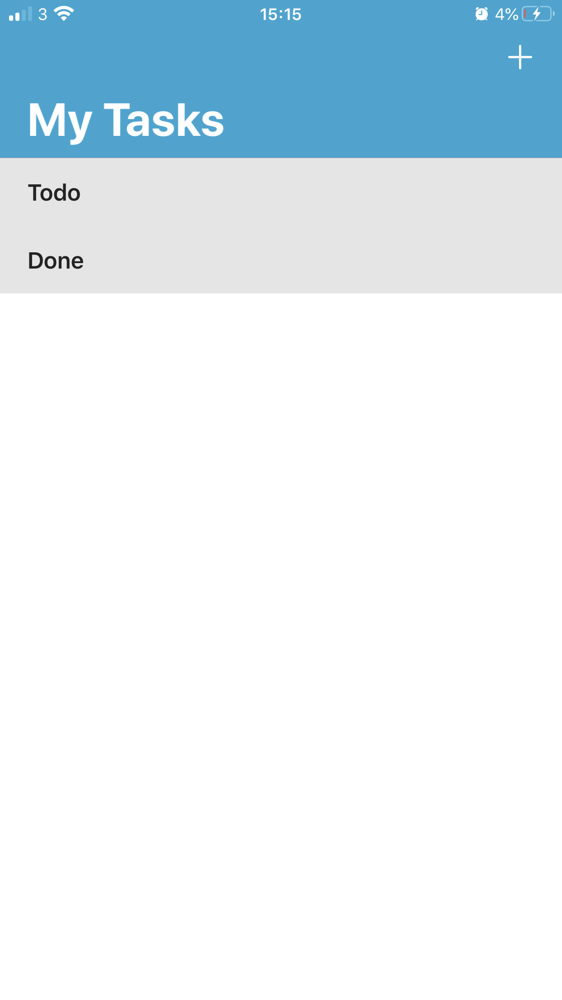
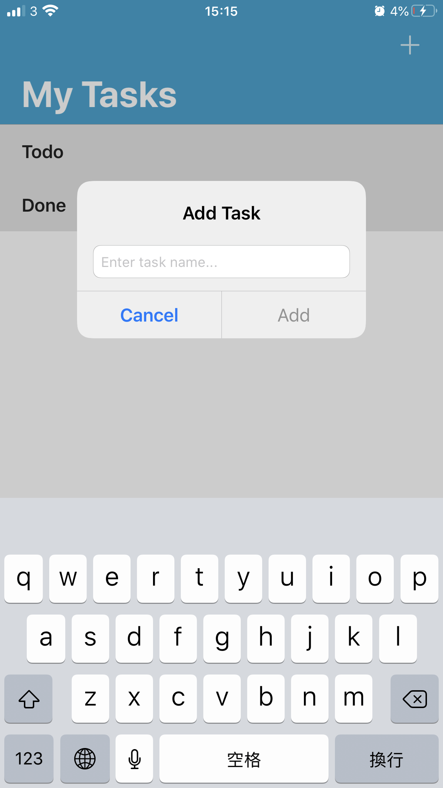
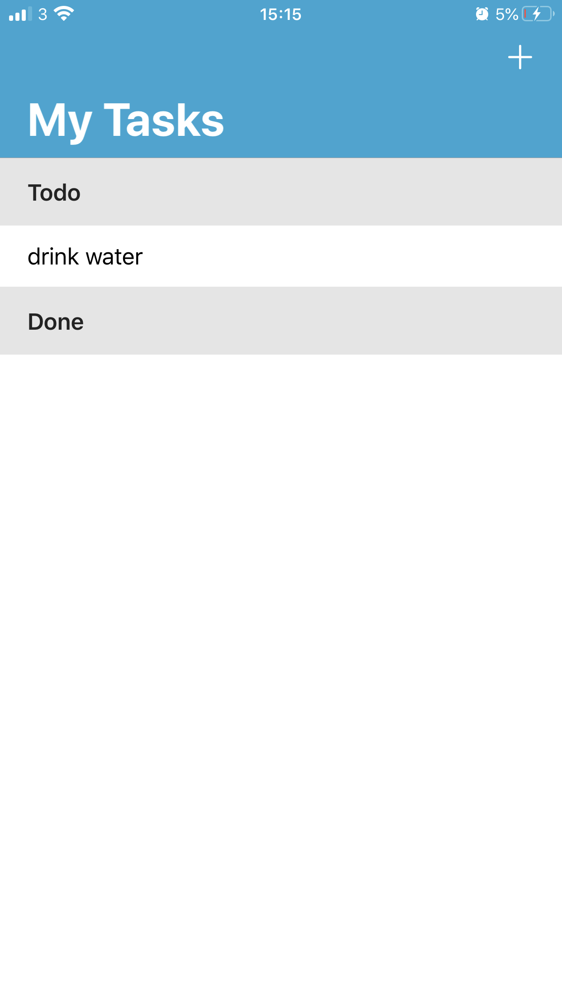
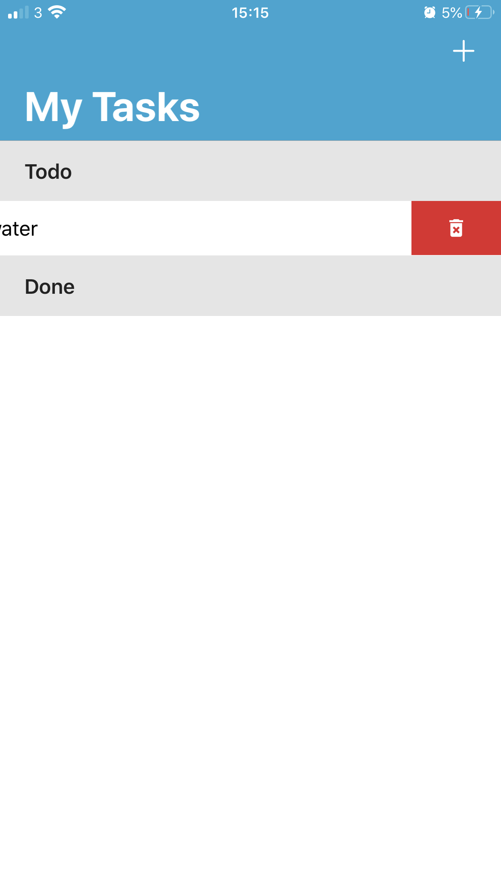
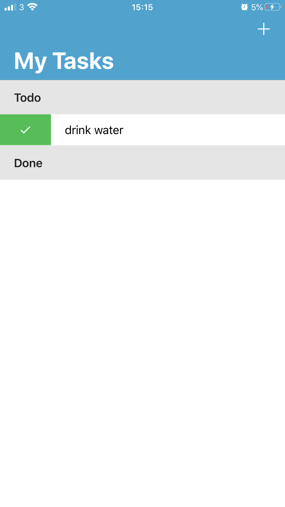
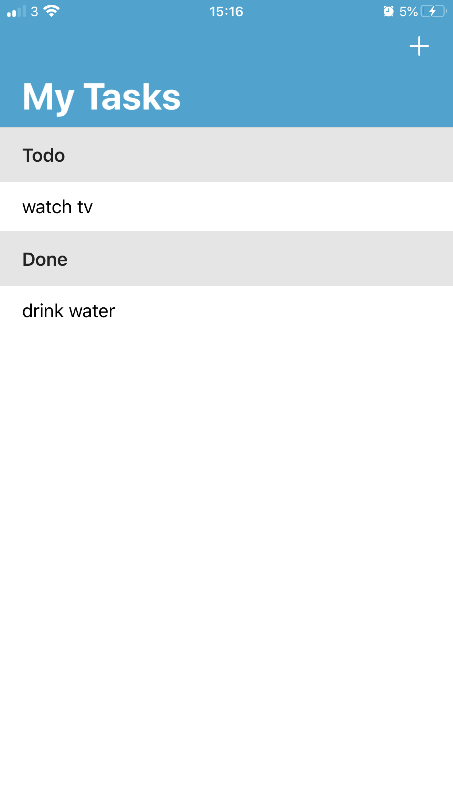

# MyTask
A Simple Todo App

## Description
As a programmer, I want to create a to-do application for myself. To find best practices, I took a course called ["iOS 12 and Swift 5: Building a To-Do List Application"](https://www.udemy.com/share/101CqCB0oYeVhWQ3w=/). Although the course is not updated to iOS 13, the instructor has a good explanation of the concept of swift. Finally, I changed some codes to fit the iOS 13.

## Preview
| No Task                        		    | Add a Task                 		       	| One task in Todo	         			      | 
| ------------------------------------- | ------------------------------------- | ------------------------------------- |
|   |   |   |

| Delete a Task				  	            	| Finish a Task				          		    | New Task is added                     |
| ------------------------------------- | ------------------------------------- | ------------------------------------- |
|   |   |   |
